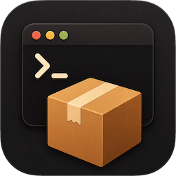

<p align="center"></p>

<h1 align="center">Home-Cellar</h1>

**A native Homebrew GUI for macOS.** Pure SwiftUI, no backend, free.

Home-Cellar is a full-featured visual layer over the `brew` binary already on your Mac. It surfaces everything that is tedious from the command line — searching 14,000+ formulae and casks, pending updates, per-package disk usage, service status, dependency trees, CVE exposure — and executes the same `brew` commands you would type, with real-time progress and logs.

## Principles

1. **Native or nothing.** Pure SwiftUI, feels like part of macOS. No web views, no Electron.
2. **brew is the source of truth.** Home-Cellar never manipulates the Cellar/Caskroom directories directly; every mutation shells out to `brew`. The CLI and the GUI can coexist mid-task.
3. **Local-first, private.** No accounts, no telemetry, no backend. Network calls are limited to package metadata (formulae.brew.sh), cask artwork (CaskFlow / App-Fair), release notes (GitHub), and CVE feeds (OSV/NVD).
4. **Free forever.** All features free, ad-free.

## Features

- **Home** — greeting dashboard: what needs attention, installed snapshot, recent activity, favorites.
- **Search catalog** — instant search over the full formula and cask catalog, with kind, deprecation, and installed-state filters.
- **Discover** — App Store-style browse pages for casks *and* formulae: Featured, Top Charts (per-period install rankings), Recently Added, and curated Categories, with real app icons.
- **Installed / Favorites / Updates** — the inventory with lenses, bulk actions, and honest treatment of self-updating apps (they are never nagged as "outdated").
- **Services** — `brew services` status and control.
- **Health** — a weighted health score over outdated packages, advisories, orphans, cache size, and `brew doctor`.
- **Security** — CVE advisory coverage for installed packages, opt-in.
- **Cleanup** — per-package disk usage, old versions, and download cache, with safe remediation.
- **Taps & Brewfile** — tap management plus Brewfile import/export.
- **History** — a searchable log of every operation Home-Cellar ran.

## Requirements

- macOS 26 (Tahoe) or later, Apple Silicon
- [Homebrew](https://brew.sh) installed — Home-Cellar detects it and guides you if it is missing; it never installs Homebrew itself

## Install

With Homebrew:

```sh
brew tap juancasanueva/cellar
brew trust juancasanueva/cellar
brew install --cask home-cellar
```

That installs `/Applications/Home-Cellar.app`, the same notarized build the releases
page serves. Homebrew 6 refuses to load a cask from a third-party tap until the
tap is trusted, which is what the middle line does; it grants nothing beyond
this tap.

A word about the fully-qualified form, `juancasanueva/cellar/home-cellar`: on
Homebrew 6, naming a qualified token on a command line **is** a per-package
trust grant, so it is not a neutral way to disambiguate a token collision. The
tap line above is. Home-Cellar never builds a qualified token — every command it
spawns names the bare token and lets the trusted tap resolve it — and Home-Cellar
grants and revokes nothing for an individual package. It shows the per-package
grants `brew trust --json v1` already reports, and it says so plainly when a
Homebrew reports none.

**Already have `Home-Cellar.app` in `/Applications`?** Homebrew refuses to
overwrite an app it did not place (`It seems there is already an App at
'/Applications/Home-Cellar.app'`). Let it adopt the existing copy instead:

```sh
brew install --cask --adopt home-cellar
```

Adoption keeps the bundle and its data where they are and simply records it as
brew-managed. Because the cask declares `auto_updates`, brew does not compare
versions before adopting: the copy you have, whatever Sparkle has updated it
to, is the one it takes over.

Or download the latest `Home-Cellar-<version>.zip` from
[Releases](../../releases), unzip it, and drag `Home-Cellar.app` to
`/Applications`.

The build is notarized and stapled, so the first launch is a single ordinary
"Open" confirmation — no right-click workaround, and no network access needed to
get past Gatekeeper. Apple Silicon and macOS 26 only.

To remove a cask install, `brew uninstall --cask --zap home-cellar` also deletes
Home-Cellar's caches, catalog, metadata and preferences. It cannot delete the two
Keychain items Home-Cellar creates — `com.juancasanueva.cellar.nvd-api-key` and
`com.juancasanueva.cellar.github-pat` — because Homebrew's uninstall has no
Keychain facility. Remove those in Keychain Access if you want them gone.

## Updates

Home-Cellar updates itself with [Sparkle](https://sparkle-project.org), from an
EdDSA-signed appcast published alongside each release. The feed URL and the
public verification key are compiled into the app, so an update is only ever
installed if its signature matches the key the running copy already carries.

**Automatic checking is off by default.** A check is a network request, and
Home-Cellar asks before making one: turn it on in **Settings → Updates**, or leave it
off and use **Home-Cellar → Check for Updates…** whenever you want. The Settings card
also shows when the last check actually happened, and says so plainly when there
has never been one.

Prereleases are never offered.

## Building

Open `cellar.xcodeproj` in Xcode and run the `cellar` scheme, or:

```sh
xcodebuild -project cellar.xcodeproj -scheme cellar -configuration Debug build
```

The core logic lives in a local Swift package with its own test suites:

```sh
cd Packages/CellarCore && swift test
```

App-level and UI tests live in `cellarTests/` and `cellarUITests/`.

## Releasing

Pushing a `v*` tag is the only thing that publishes a release. CI builds an
arm64, Developer ID-signed, notarized and stapled `Home-Cellar-<version>.zip`
and attaches it to a GitHub Release; every gate runs before publication, so a
failed run publishes nothing.

The same job publishes the Sparkle appcast to GitHub Pages on a stable tag; a
prerelease tag publishes a release and no feed entry.

The runbook, prerequisites, version policy and entitlements rationale live in
[`RELEASING.md`](RELEASING.md).

## Architecture

The app target (`cellar/`) is a thin SwiftUI shell — composition root, stores, and views. Everything testable lives in `Packages/CellarCore`, split into single-purpose libraries with deliberately one-directional edges:

| Module | Responsibility |
|---|---|
| `BrewProcess` | Spawning and streaming the `brew` binary |
| `Catalog` | Catalog sync, search index, and Discover projections — never needs a `brew` binary |
| `BrewClient` | Installed inventory, mutations, services — the only module that sees both sides |
| `DiskUsage` | Per-package disk measurement |
| `SecurityKit` | Advisory (CVE) lookup and coverage |
| `ReleaseNotes` | Release-notes resolution via published repository URLs |
| `Persistence` | Favorites, notes, snoozes, history |

Product requirements and the design record live in [`PRD.md`](PRD.md); change specs live under `openspec/`.

## Third-party content

Cask category and added-date data originate from the [CaskHub](https://github.com/alielsokary/CaskHub) project (MIT), and the embedded update framework is [Sparkle](https://github.com/sparkle-project/Sparkle) 2.9.6 (MIT). See [`THIRD-PARTY.md`](THIRD-PARTY.md).
